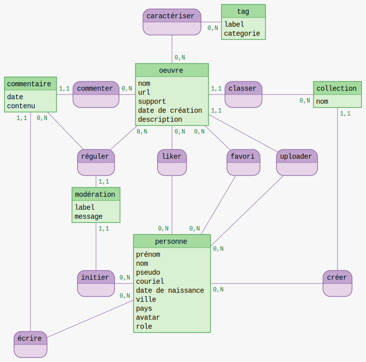

```python
%reload_ext mocodo
```

## MCD


```python
%%mocodo --colors brewer+3

:
caractériser, 0N oeuvre, 0N tag
tag: _label, categorie

:
:
:

commentaire: _date, contenu
commenter, 11 commentaire, 0N oeuvre
oeuvre: _nom, url, date de création, description
classer, 11 oeuvre, 0N collection
:
collection: _nom

:

:
réguler, 0N commentaire, 0N oeuvre, 11 modération
liker, 0N personne, 0N oeuvre
favori, 0N personne, 0N oeuvre
uploader, 0N personne, 11 oeuvre
:


modération: _label, message
:
:


:
initier, 0N personne, 11 modération
personne: _prénom, nom, pseudo, courriel, date de naissance, ville, pays, avatar, role
:
:
créer, 0N personne, 11 collection

écrire, 0N personne, 11 commentaire
:
:
:
:
:
```


    

    


## MLD

- tag (<u>codeTag</u>, label, categorie)
- caractériser (#codeTag, #codeOeuvre)
- oeuvre (<u>codeOeuvre</u>, nom, url, date, description, #codeCollection, #codeAuteur)
- commentaire (<u>codeCommentaire</u>, date, contenu, #codeOeuvre, #codeAuteur)
- collection (<u>codeCollection</u>, nom, #codeAuteur)
- modération (<u>codeModération</u>, label, message, #codeAuteur, #codeOeuvre, #codeCommentaire)
- like (#codeOeuvre, #codeAuteur)
- favori (#codeOeuvre, #codePersonne)
- personne (<u>codePersonne</u>, prénom, nom, pseudo, courriel, date de naissance, ville, pays, avatar, role

## MPD

- tag: <u>id(INT)</u>, label(text), category(enum)
- mark: #tag_id(int), #oeuvre_id(int)
- artwork: <u>id(int)</u>, label(text), uri(text), date(timestampz), description(text), #collection_id(int), #person_id(int)
- comment: <u>id(int)</u>, date(timestampz), content(text), #artwork_id(int), #person_id(int)
- collection: <u>id(int)</u>, label(text), #person_id(int)
- moderate: <u>id(int)</u>, label(text), message(text), #person_id(int), #oeuvre_id(int), #comment_id(int)
- like: #oeuvre_id(int), #person_id(int)
- favorite: #oeuvre_id(int), #person_id(int)
- person: <u>id(int)</u>, firstname(text), lastname(text), nickname(text), email(text), birthday(date), town(text), country(text), avatar(tex), role(enum)


### types

- label (tag) : aquarelle, photo, gravure, papier, …
- category (tag) : type, support, style
- label (moderate) : alert, hide
- role (person) : user, creator, admin

## Dictionnaire de données

### table *tag*

| Champ| Type| Spécifités| Description|
|---|---|---|---|
| id | int | generated always as identity primary key | identifiant du tag |
| label | enum | unique not null | nom du tag : liste à définir |
| category | enum | unique not null | catégorie du tag : type, support, style |

### table d'association *mark* entre les table *tag* et *artwork*

| Champ| Type| Spécifités| Description|
|---|---|---|---|
| tag_id | int | references tag(id) | identifiant du tag |
| artwork_id | int | references artwork(id) | identifiant de l'artwork |

### table *artwork*

| Champ| Type| Spécifités| Description|
|---|---|---|---|
| id | int | generated always as identity primary key | identifiant de l'artwork |
| label | text | not null | titre de l'œuvre |
| uri | text | unique not null | url d'accés à l'œuvre |
| date | timestampz | | date de création de l'œuvre |
| description | text | not null | description accompagnant l'œuvre |
| collection_id | int | references collection(id) | identifiant d'une collection |
| person_id | int | references person(id) | identifiant de l'auteur de l'œuvre |

### table *comment*

| Champ| Type| Spécifités| Description|
|---|---|---|---|
| id | int | generated always as identity primary key | identifiant du commentaire |
| content | text | not null | contenu du commentaire |
| artwork_id | int | references artwork(id) | identifiant de l'œuvre |
| person_id | int | references person(id) | identifiant de l'auteur du commentaire |
| created_at | timestampz | not null default now() | date d'écriture du commentaire |
| updated_at | timestampz | | date de modification du commentaire |

### table *collection*

| Champ| Type| Spécifités| Description|
|---|---|---|---|
| id | int | generated always as identity primary key | identifiant de la collection |
| label | text | not null | titre de la collection |
| person_id | int | references person(id) | identifiant du propriétaire de la collection |

### table *moderate*

| Champ| Type| Spécifités| Description|
|---|---|---|---|
| id | int | generated always as identity primary key | identifiant de la modération |
| label | enum | not null | type de modération : alert, hide |
| message | text | not null | message justifiant l'action |
| person_id | int | references person(id) | identifiant de l'auteur de la modération |
| oeuvre_id | int | references oeuvre(id) | identifiant de l'oeuvre concernée |
| comment_id | int | references comment(id) | identifiant du commentaire concerné |

### table d'association *like* entre les tables *artwork* et *person*

| Champ| Type| Spécifités| Description|
|---|---|---|---|
| artwork_id | int | references artwork(id) | identifiant de l'œuvre |
| person_id | int | references person(id) | identifiant de l'auteur du like |

### table d'association *favorite* entre les tables *artwork* et *person*

| Champ| Type| Spécifités| Description|
|---|---|---|---|
| artwork_id | int | references artwork(id) | identifiant de l'œuvre |
| person_id | int | references person(id) | identifiant du propriétaire de la liste de favoris |


### table *person*

| Champ| Type| Spécifités| Description|
|---|---|---|---|
| id | int | generated always as identity primary key | identifiant de la person |
| firstname | text | not null | prénom |
| lastname | text | not null | nom de famille |
| nickname | text | unique not null | pseudonyme / nom affiché |
| email | text | unique not null | addresse de contact et identifiant de connexion |
| birthday | timestampz | not null | date de naissance pour déterminer la majorité ou non |
| town | text | | ville |
| country | text | | pays |
| avatar | text |  | URL où récupérer une image d'avatar, en cas d'absence une version automatique sera créée |
| role | enum | not null | situation sur le site : user, creator, moderator |


```python

```
